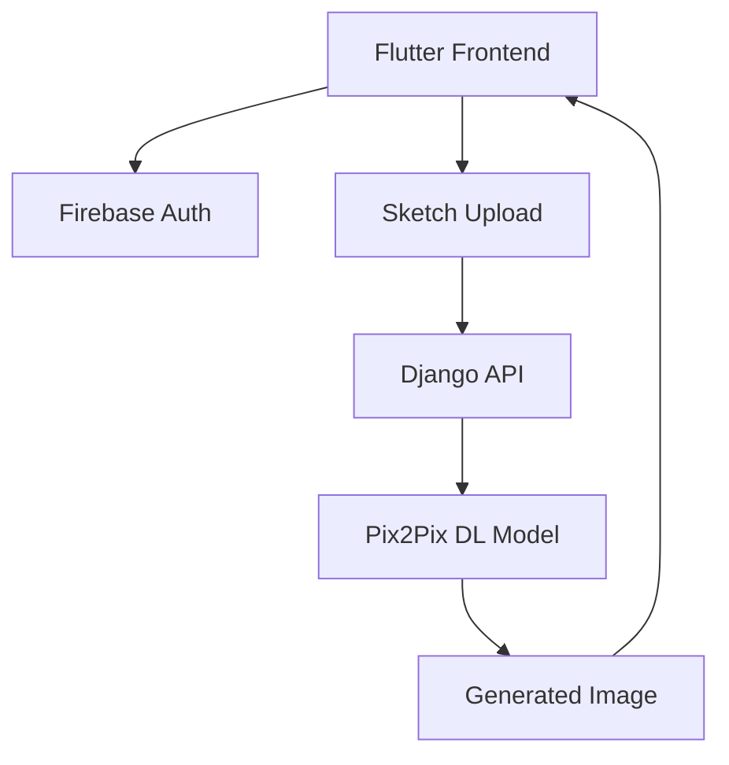
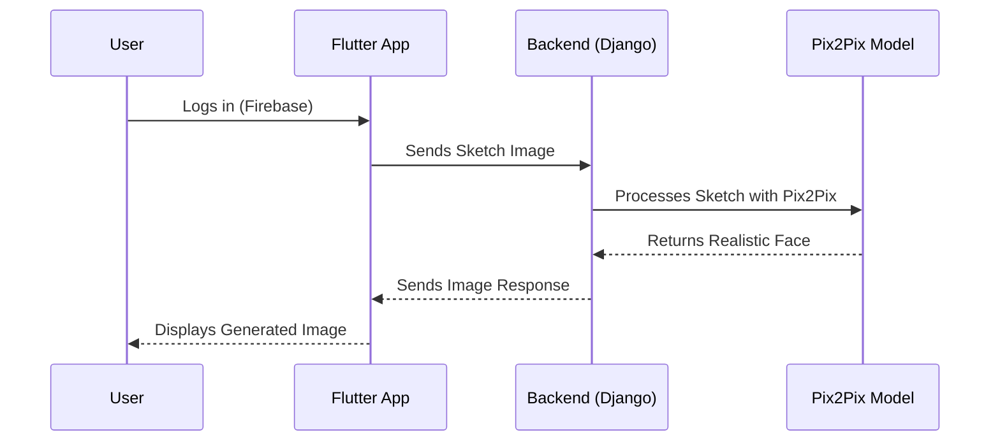
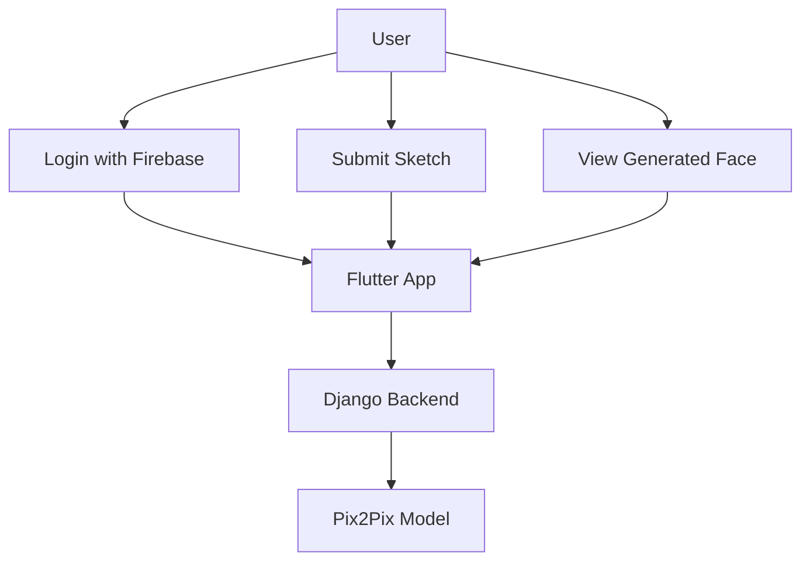

# 🤖 **Human\_Genx – Sketch-to-Face AI Generator**

> *A cross-platform artistic AI application built using **Flutter**, **Django**, and a **Pix2Pix deep learning model** for transforming sketches into realistic human faces.*

---

## 🧠 **Overview**

**Human\_Genx** is a mobile application that leverages deep learning and modern app architecture to offer users a unique creative experience: **draw a sketch, and receive a realistic human face**.

This is achieved through the combination of:

* **Flutter** (Frontend UI)
* **Firebase Authentication** (Secure user login)
* **Django Rest Framework** (API & model serving)
* **Pix2Pix** model (Deep learning sketch-to-face mapping)

---

## 🔧 **Tech Stack**

| Layer                | Technology                               |
| -------------------- | ---------------------------------------- |
| **Frontend**         | Flutter                                  |
| **Backend**          | Django REST Framework                    |
| **Authentication**   | Firebase Auth                            |
| **Deep Learning**    | TensorFlow + Keras (Pix2Pix model)       |
| **Model Deployment** | Django API endpoint for image generation |
| **Mobile Platforms** | Android, iOS                             |

---

## 📸 Project Preview


---

## 🎯 Key Features

* ✏️ Sketch-to-Real Human Face generation
* 🔐 Firebase Authentication
* 🌐 RESTful API communication (Flutter ↔ Django)
* 🤖 DL Model: Pix2Pix trained on facial data
* 🔁 Real-time image generation & response

---

## 🔄 Flow Summary

### User Flow

```
[User draws sketch in app]
       ↓
[Sketch uploaded via Flutter]
       ↓
[Image sent to Django REST API]
       ↓
[Pix2Pix model generates realistic face]
       ↓
[Generated face sent back to user]
```

---

## 📐 System Architecture (Mermaid Diagram)



---

## 🧬 Sequence Diagram



---

## 🎭 Use Case Diagram



---

## 🏁 Getting Started (For Developers)

### 📱 Flutter Setup

Make sure you have Flutter installed. Then:

```bash
git clone https://github.com/jayanth119/Human_Genx.git
cd Human_Genx/client
flutter pub get
flutter run
```

Update your Firebase configuration in:

* `android/app/google-services.json`
* `ios/Runner/GoogleService-Info.plist`

---

### 🧠 Backend Setup (Django + Pix2Pix)

```bash
cd Human_Genx/server
python -m venv venv
source venv/bin/activate  # or venv\Scripts\activate on Windows
pip install -r requirements.txt
python manage.py runserver
```

Make sure your model is trained and saved as `pix2pix_model.h5` inside the model folder.

---

## 📂 Project Structure

```
Human_Genx/
├── client/                # Flutter app code
│   └── lib/
│       └── screens/
├── server/                # Django backend
│   ├── ml/                # Pix2Pix model code
│   ├── api/               # Django REST views & serializers
│   └── media/             # Uploaded & generated images
├── diagrams/              # All diagrams (UML, sequence, mermaid)
└── README.md              # Project documentation
```

---

## 🧪 Model Details – Pix2Pix

* **Architecture**: Conditional GAN
* **Input**: Binary sketch image (512x512)
* **Output**: RGB photo-realistic image
* **Frameworks**: TensorFlow 2.x, Keras
* **Trained on**: Custom dataset of faces + sketches

---

## 📈 Future Enhancements

* 📦 Deploy model to TensorFlow Serving or Hugging Face Inference API
* 🌍 Use WebSockets for real-time image feedback
* 🔄 Add Undo/Redo support for sketch input
* 📲 iOS and Android deployment on Play Store / App Store

---

## ✍️ Author

**👤 Jayanth Chukka**
Full-stack Developer & AI Researcher
🔗 [GitHub - jayanth119](https://github.com/jayanth119)

---
